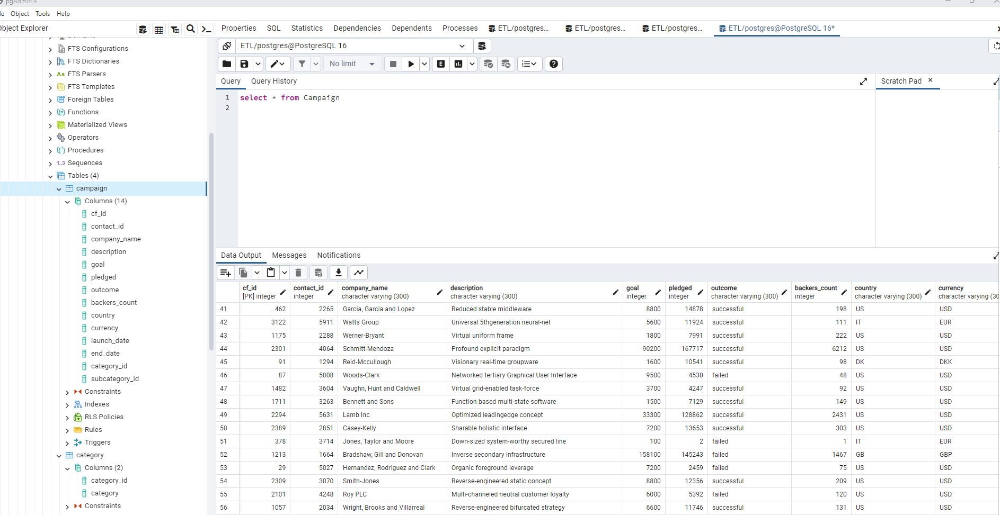
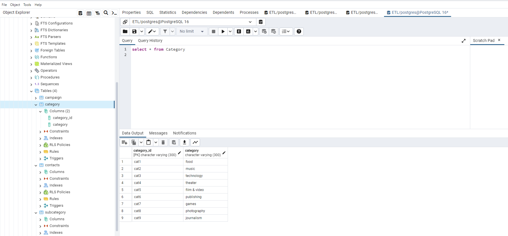
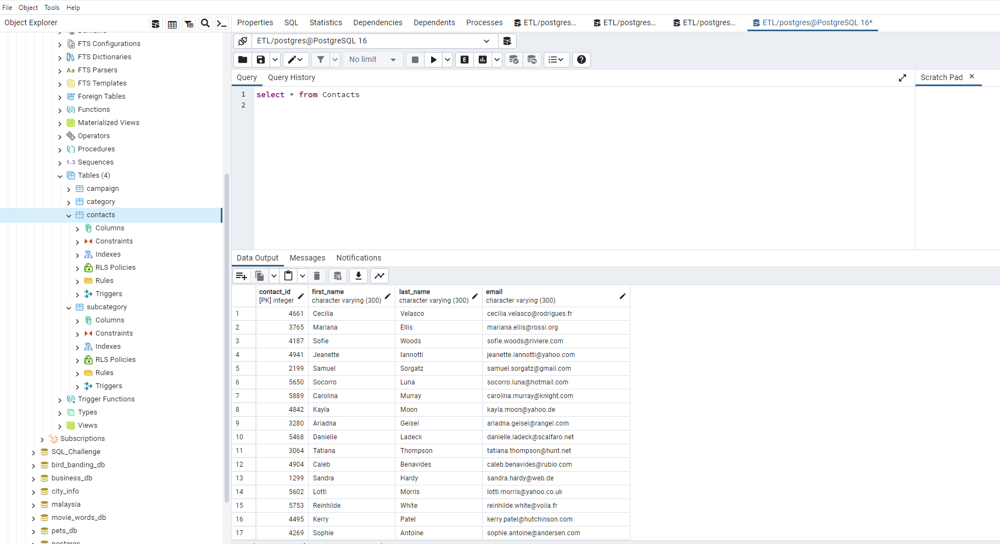
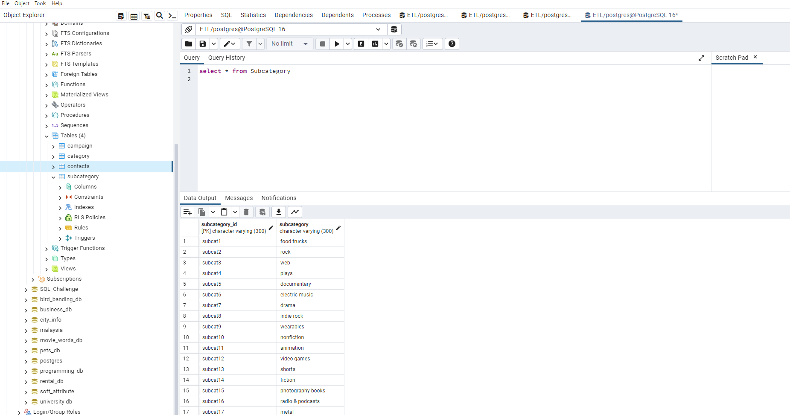
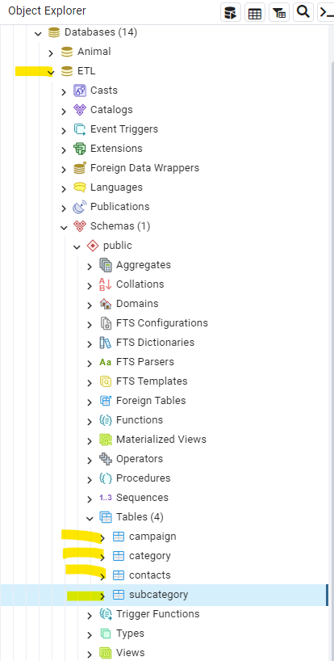

# Crowdfunding_ETL
Project 2
Resources:
Class activities week 13 Tuesday and Thursday class activities were main contributors to my part in the challenge.
Part one : Create category and subcategory data frames.
Split the column 'categories & sub-categories' into two columns. Create cat ids and scat id's.
Save a category dataframe and save as a csv - save a subcaegories dataframe and save as a csv.
The csv files are saved in the Resources folder in Git Hub.

CSV File 'Campain' reqiures the Goal column to be converted to a number without decimal places.

 screen shot of SQL Campaign Table
 screen shot of SQL Categories Table
 screen shot of SQL Contacts Table
 screen shot of SQL Subcategory Table
 Screen shot of SQL all tables
